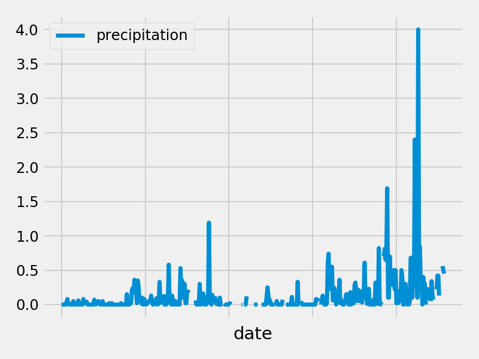
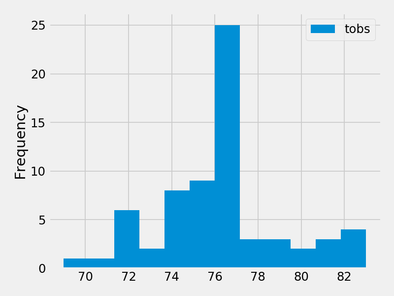

# Climate Analysis Dashboard

Scenario: We're going on a holiday vacation to Honolulu, Hawaii, and we need to do some trip planning. We're going to conduct a climate analysis using a database of Honolulu, Hawaii's historical climate to make sure the weather will be nice when we visit then build a Flask API to vizualize the insights from our analysis.

Tools: Python, Pandas, Matplotlib, Jupyter, SQLAlchemy, SQLite, and Flask.

## Climate Analysis & Exploration

### Precipitation Analysis

* The last 12 months of precipitation data.

  

### Station Analysis

* Total number of stations and most active stations.

  

### Temperature Analysis

### Calculating Daily Normals

- - -
